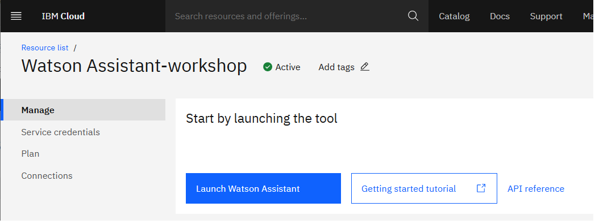
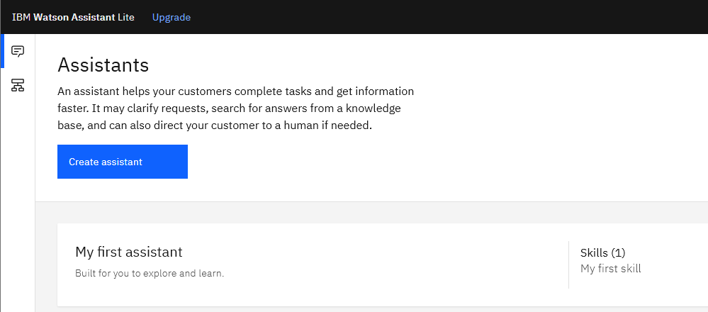
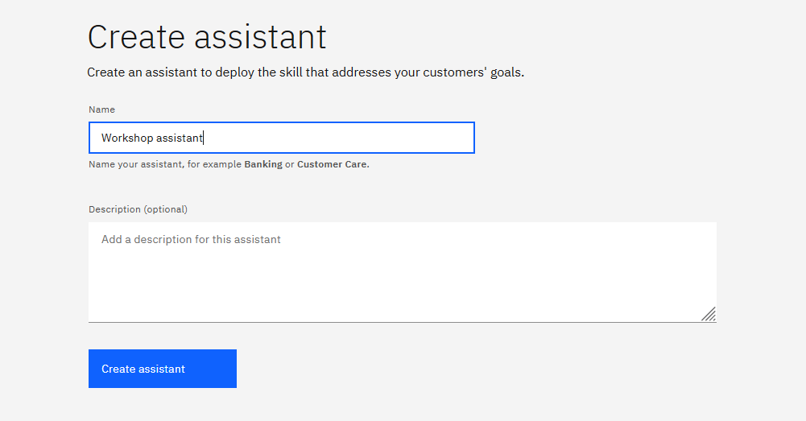
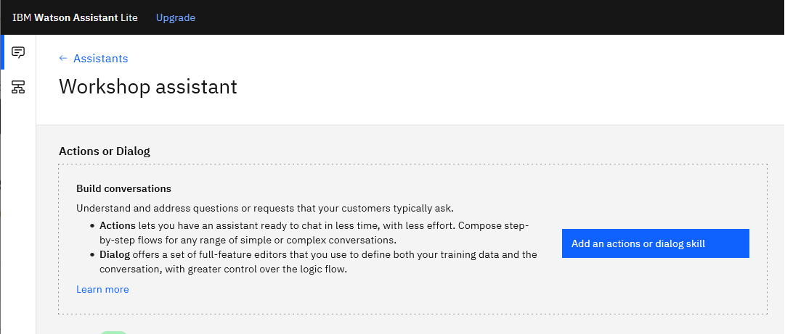
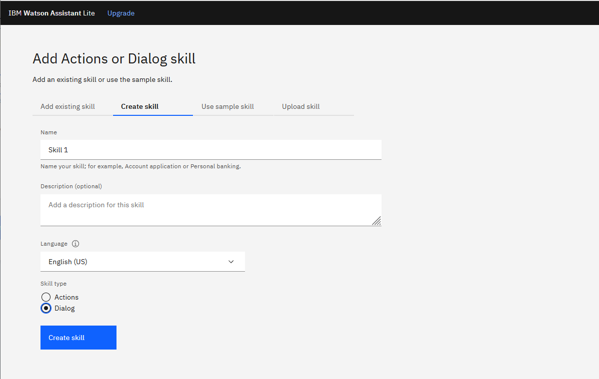
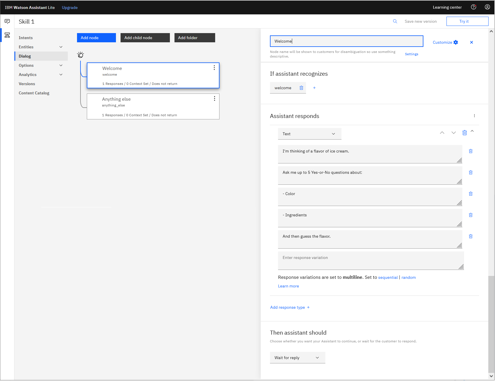
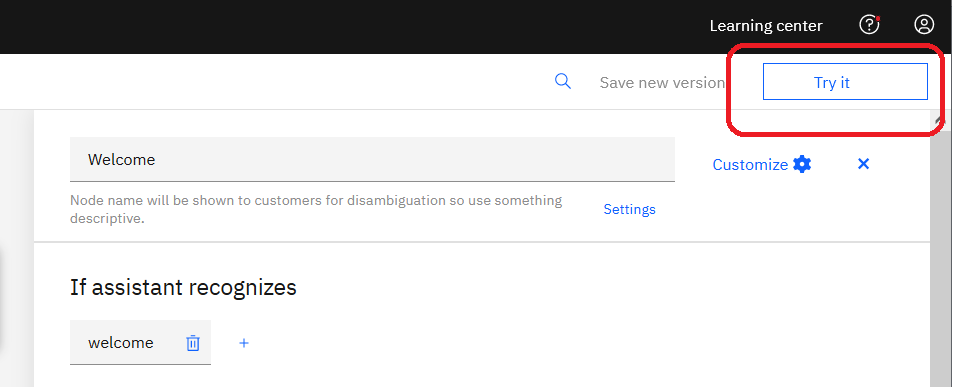
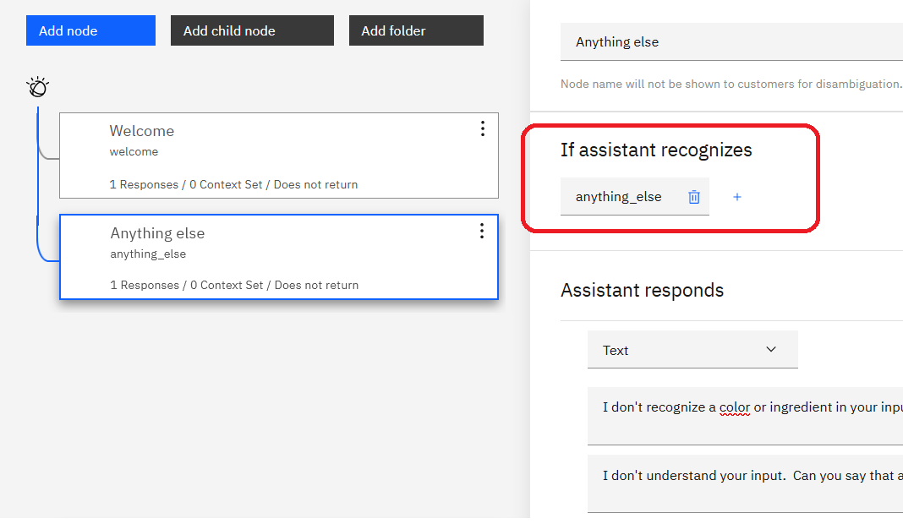
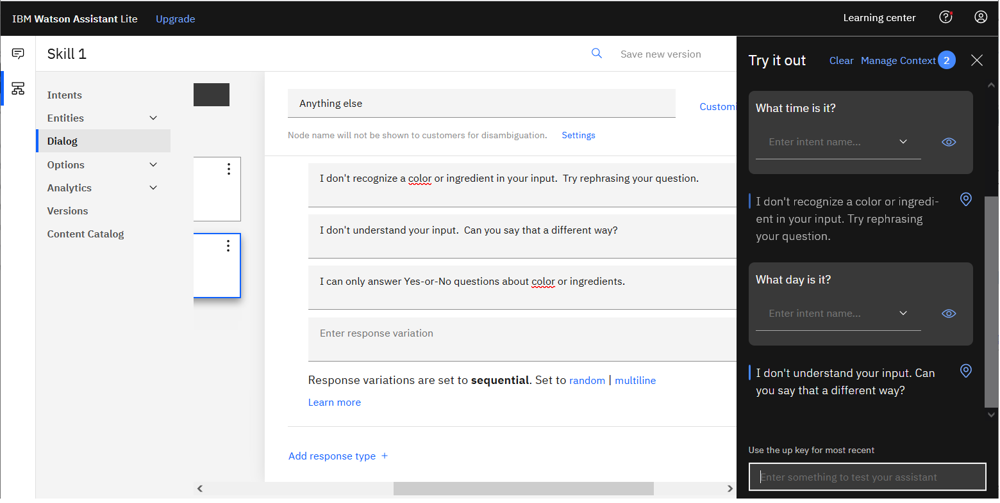

# Section A: Create an assistant with a dialog skill

- [Step 1: Create an assistant](#step-1-create-an-assistant)
- [Step 2: Create a dialog skill](#step-2-create-a-dialog-skill)
- [Step 3: Define a welcome message](#step-3-define-a-welcome-message)
- [Step 4: Preview your chatbot](#step-4-preview-your-chatbot)
- [Step 5: Define a fallback message](#step-5-define-a-fallback-message)

&nbsp;

## Step 1: Create an assistant
<ol>
<li>

From your IBM Cloud dashboard ( <a href="https://cloud.ibm.com/resources">https://cloud.ibm.com/resources</a> ), navigate to the <b>Manage</b> tab of the Watson Assistant service details page.  Then, click <b>Launch Watson Assistant</b>: 

</li>
<li>

Create a new assistant by clicking <b>Create assistant</b>: 

</li>
<li>

Name the assistant, and then click <b>Create assistant</b>: 

</li>
</ol>

&nbsp;

## Step 2: Create a dialog skill
<ol>
<li>

Click <b>Add an actions or dialog skill</b>: 

</li>
<li>

On the <b>Create skill</b> tab, name the skill, select a "Dialog" skill type, and then click <b>Create skill</b>: 

</li>
<li>

To begin working on your new assistant and its skill, click the skill you just created.

</li>
</ol>

&nbsp;

<table>
<tr>
<td>
<h3>Terminology</h3>

You can have only one <b><i>service instance</i></b> of the Watson Assistant Lite plan in your IBM Cloud account: 
<a href="https://cloud.ibm.com/catalog/services/watson-assistant">https://cloud.ibm.com/catalog/services/watson-assistant</a>

<b><i>Skills</i></b> are where you implement your conversation flow.  There are three types of skills:

<ul>
<li>Search skill - For integrating IBM Watson Discovery search into your chatbot. (Not available with the Lite plan.)</li>
<li>Dialog skill - The traditional Watson Assistant GUI interface for defining your conversation flow.</li>
<li>Actions skill - The next generation of the IBM Watson Assistant GUI interface.</li>
</ul>

For this workshop, we'll be using dialog skills only.  In your Lite plan, you can create up to 5 dialog skills: 
<a href="https://cloud.ibm.com/docs/assistant?topic=assistant-skill-add#skill-add-limits">https://cloud.ibm.com/docs/assistant?topic=assistant-skill-add#skill-add-limits</a>

<b><i>Assistants</i></b> are the mechanism by which you <i>deploy</i> (or <i>publish</i>) a chatbot - to a web page, for example.  In your Lite plan, you can create up to 100 assistants: 
<a href="https://cloud.ibm.com/docs/assistant?topic=assistant-assistant-add">https://cloud.ibm.com/docs/assistant?topic=assistant-assistant-add</a>

In your Lite plan, you can associate one dialog skill with one or more assistants: 
<a href="https://cloud.ibm.com/docs/assistant?topic=assistant-skill-add">https://cloud.ibm.com/docs/assistant?topic=assistant-skill-add</a>

Summary:

<ul>
<li>You implement your conversation in a skill</li>
<li>You associate a skill with an assistant</li>
<li>You deploy assistants, not individual skills</li>
</ul>
</td>
</tr>
</table>

&nbsp;

## Step 3: Define a welcome message
When user input is received by the chatbot, the input is compared with the <b><i>If assistant recognizes</i></b> condition of each dialog node in your dialog tree, starting with the top node.  The input is analyzed by the first dialog node with conditions the input satisfies.

One special case is: When people first visit your chatbot, that is the <code>welcome</code> condition.  When you create a new skill, a default "Welcome" dialog node is provided at the top of the dialog tree.

In the following example, the chatbot is using a <b><i>multiline</i></b> message to relay the rules of the game and to tell users how to play:

Add your message to the "Welcome" dialog node.

&nbsp;

<table>
<tr>
<td>
<h3>Special conditions</h3>

In the <b>If assistant recognizes</b> section of the "Welcome" dialog node, the <b><i>special condition</i></b>, <code>welcome</code>, is specified by default.

There are a number of special conditions in Watson Assistant, including two that we'll be using in this workshop: <code>welcome</code> and <code>anything_else</code>.

For more information, see: <a href="https://cloud.ibm.com/docs/assistant?topic=assistant-dialog-overview#dialog-overview-special-conditions">Special conditions</a>

</td>
</tr>
</table>

&nbsp;

<table>
<tr>
<td>
<h3>Conversation design</h3>

If your chatbot starts the conversation by saying something very open-ended, like "Ask me anything", then users will be disappointed when the chatbot cannot answer all of their random questions.

A better choice is to use your welcome message to perform two important functions:
<ul>
<li>Set user expectations - Clarify what the chatbot can and cannot do</li>
<li>Shape user behavior - Tell the user the best way to interact with the chatbot</li>
</ul>
</td>
</tr>
</table>

&nbsp;

## Step 4: Preview your chatbot
You can quickly test your dialog by clicking <b>Try it</b>:

&nbsp;

## Step 5: Define a fallback message
The final node in the dialog tree has the special condition <code>anything_else</code>:

If user input doesn't match the conditions for any other nodes in the tree, the final node will be triggered because <code>anything_else</code> matches anything.

In the "Anything else" dialog node, enter several messages.  For variety, leave the dialog node to return one of them in <b>sequential</b> order:

&nbsp;

<table>
<tr>
<td>
<h3>Conversation design</h3>

We sometimes are told to "give chatbots personality".  But anthropomorphism in chatbot design is an active area of academic study.  In short: Do not assume that humanizing your chatbot by using quirky, emotional language will increase user adoption of, success with, or even enjoyment of your chatbot.

In the context of product support chatbots, we can see in chatbot logs that users get frustrated quickly when a chatbot is returning incorrect answers.  And when things are going wrong, cutesy messages annoy users even more.  

We can also learn from a related area: error message design for other types of software.  There is decades of research and practice to help guide our choices with chatbot error messages.

When designing error messages for chatbots, keep these points in mind:
<ul>
<li>Keep error messages short
<li>Be transparent by explaining the error (eg. Not just: "An error occurred")
<li>Give the user direction about what to do next
<li>Avoid cute or humorous messages (eg. "Woops")
<li>Avoid excessive anthropomorphism and social cues (eg. "Sorry", "Please", "Thanks")
</ul>
</td>
</tr>
</table>

&nbsp;

