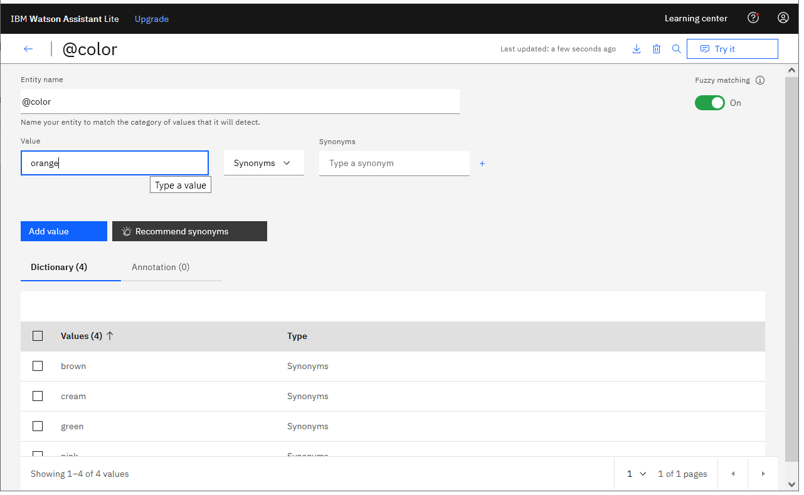
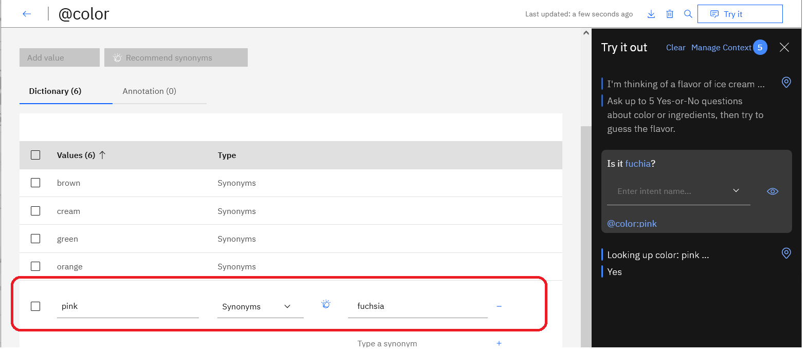
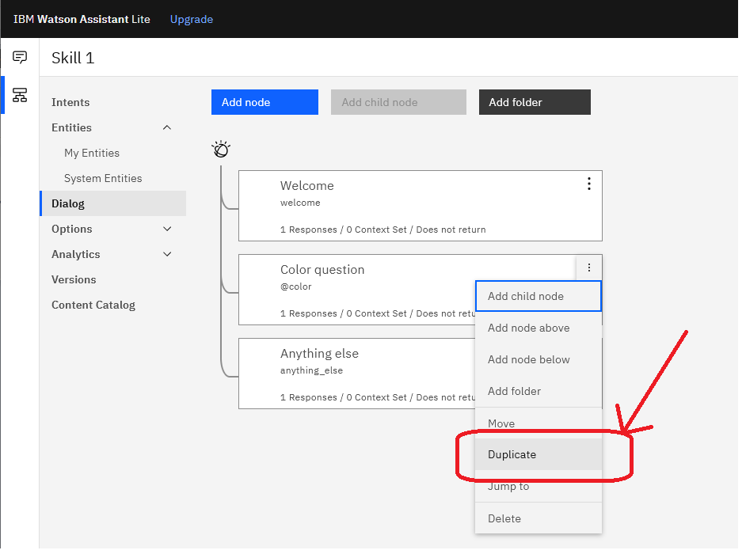
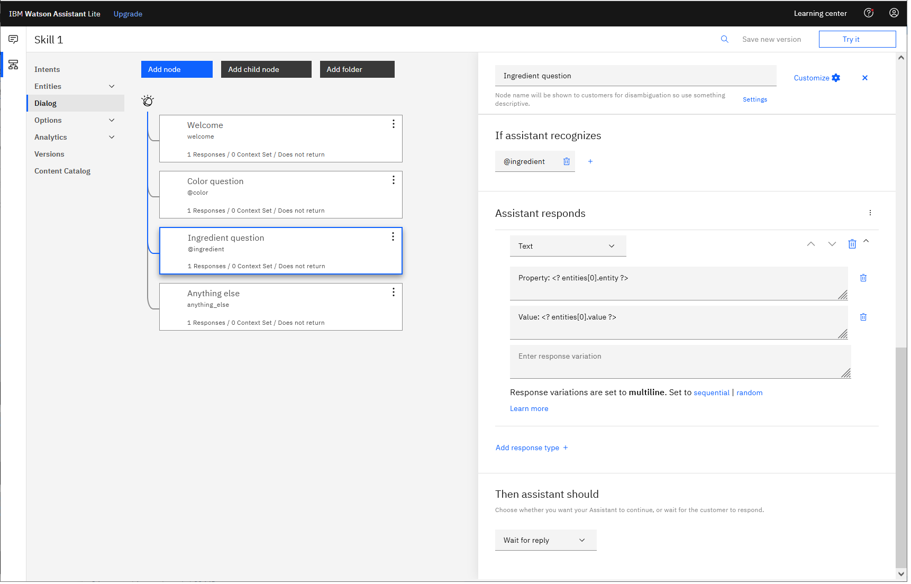
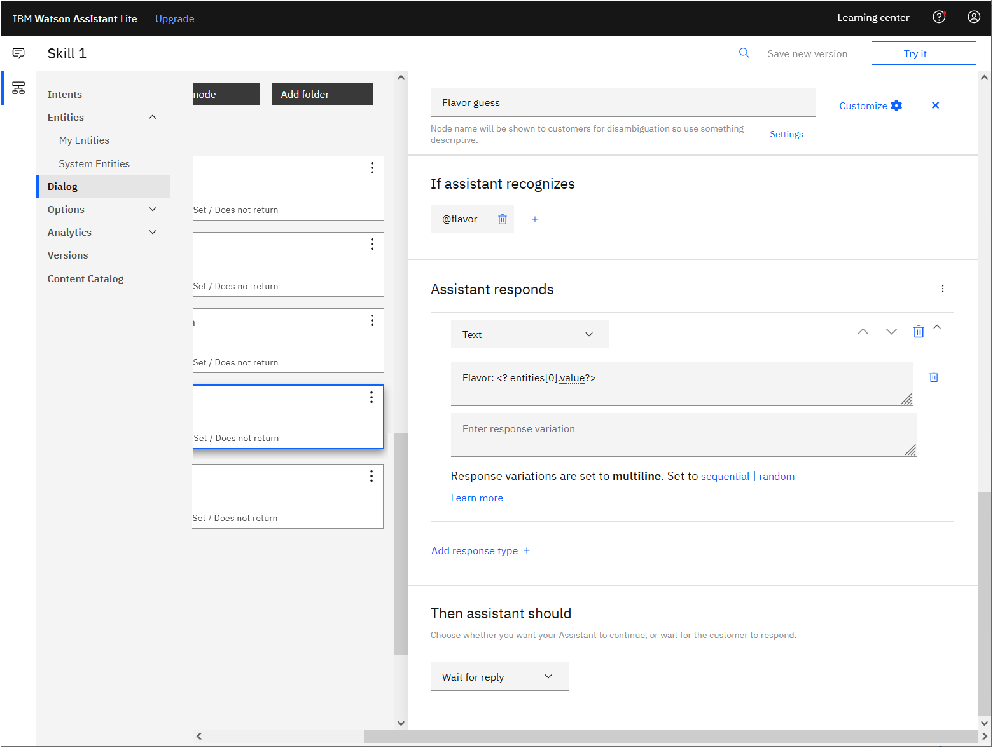
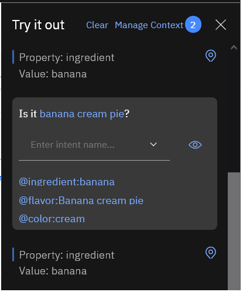

# Section B: Define entities for colors, ingredients, and flavor names

Full instructions:
- [Step 1: Recognize when users mention a color](#step-1-recognize-when-users-mention-a-color)
- [Step 2: Recognize when users mention an ingredient](#step-2-recognize-when-users-mention-an-ingredient)
- [Step 3: Recognize when users mention a flavor](#step-3-recognize-when-users-mention-a-flavor)

<p>&nbsp;</p>


## Step 1: Recognize when users mention a color

### 1.1 Define entity
<ol>
<li>
<p>Click the <b>Entities > My entities</b> menu entry:<br/>
</p>
</li>
<li>
<p>Click the <b>Create entity</b> button:<br/>
</p>
</li>
<li>
<p>Name the new entity <code>color</code> and then click the <b>Create entity</b> button:<br/>
</p>
</li>
<li>
<p>Add several color values:<br/>
</p>
</li>
<li>
<p>To get back to the entities menu, click the left arrow:<br/>
</p>
</li>
</ol>

<p>&nbsp;</p>

<table>
<tr>
<td>
<h3>Synonyms</h3>
<p><b>Synonyms</b> are a mechanism to cause the chatbot to recognize different words that mean the same thing as one of your entity values.  When a user inputs a synonym, the chatbot <b><i>normalizes</i></b> the run-time value to the root entity value</i> (also known as: the <i>lemma</i>.)</p>
<p>In the following example, you can see:</p>
<ul>
<li>The word <code>fuchsia</code> has been defined as a synonym for <code>pink</code></li>
<li>The user asked, "Is it fuchsia?"</li>
<li>But the chatbot then looks up the answer to the question "Is it pink?"</li>
</ul>
</p>
<p></p>
</td>
</tr>
</table>

<p>&nbsp;</p>

<table>
<tr>
<td>
<h3>Fuzzy matching</h3>
<p><b>Fuzzy matching</b> is a mechanism to cause the chatbot to recognize misspellings and word variations (also known as <i>stemming</i>.)</p>
<p>In the following example, you can see:</p>
<ul>
<li>The word <code>banana</code> does not have the plural, <code>bananas</code>, defined as a synonym; but when the user asks "Does it have bananas?" the chatbot looks up the answer to the question "Does it have banana?"</li>
<li>Also, a user has asked "Is it oragne?", misspelling <code>orange</code>; but the chatbot looks up the answer to the question "Is it orange?"</li>
</ul>
</p>
<p></p>
</td>
</tr>
</table>

<p>&nbsp;</p>


### 1.2 Create dialog node
<ol>
<li>
<p>On the <b>Dialog</b> page, add a new dialog node below the "Welcome" node:<br/>
</p>
</li>
<li>
<p>Name the node something helpful, like: <code>Color question</code></p>
</li>
<li>
<p>In the section labeled "If assistant recognizes", add the entity: <code>@color</code></p>
</li>
</ol>

### 1.3 Try it with debug output
In the section labeled "Assistant responds", print the system variable called <i>entities</i>:
<pre>&lt;? entities ?></pre>

Then, try it with a question like <code>Is it pink?</code>:


The result is in JSON format, an array with one matched word:
```
[
   {
      "entity"     : "color",    <-- The entitiy name you defined
      "location"   : [ 6, 10 ],  <-- The location of the matched word in the input string
      "value"      : "pink",     <-- The specific value that was matched
      "confidence" : 1.0         <-- A number, ranging from 0.0 to 1.0
   }
]
```

For more information about <b><i>expressions</i></b> for accessing matched entities, see: [Accessing entities](https://cloud.ibm.com/docs/assistant?topic=assistant-expression-language#expression-language-access-entity)


### 1.4 Print exactly what is matched
<ol>
<li>
<p>In the section labeled "Assistant responds", change the response to a <b>multiline</b> response that prints the name and the value of the first matched entity:
<pre>Property: &lt;? entities[0].entity ?></pre>
and
<pre>Value: &lt;? entities[0].value ?></pre></p>
</li>
</ol>


<p>&nbsp;</p>

<table>
<tr>
<td>
<h3>Entities vs. Intents</h3>
<p>In general:</p>
<ul>
<li><p><b><i>Entities</i></b> are important words matched in a user's input, like using Watson Natural Language Understanding (NLU).  Entities are usually the best way to identify what the user is specifically talking about. (eg. "pink" vs. "green")</p></li>
<li><p><b><i>Intents</i></b> are classes, like using Watson Natural Language Classier (NLC).  Intents are usually the best way to identify the type of input. (eg. A goodbye message vs. a game-playing question)</p></li>
</ul>
<p>To learn more about NLU and NLC, see: <a href="https://github.ibm.com/spackows/AI-ContentOps/tree/master/workshops#internal-content-design-nlp-workshop-series">Content Design NLP workshop series</a></p>
</p>
The bonus material explores creating Intents.
</td>
</tr>
</table>

<p>&nbsp;</p>


## Step 2: Recognize when users mention an ingredient

### 2.1 Download entities file
<ol>
<li>
<p>Right-click the following link and open it in a new browser tab: <a href="./entities.csv"><code>entities.csv</code></a></p>
</li>
<li>
<p>Click <b>Raw</b>.</p>
</li>
<li>
<p>Right-click in the middle of the page, and then select: "Save Page As ..."</p>
</li>
<li>
<p>When saving the file, be sure to save the file with the <code>.csv</code> extension, not as the default type, <code>.txt</code>.</p>
</li>
</ol>

### 2.2 Upload entities from file
<ol>
<li>
<p>In Watson Assistant, click the <b>Entities > My entities</b> menu entry.</p>
</li>
<li>
<p>Click the <b>Upload entities</b> icon:<br/>
</p>
</li>
<li>
<p>Follow the prompts to upload the file you downloaded, <code>entities.csv</code></p>
</li>
</ol>

<p>&nbsp;</p>

<table>
<tr>
<td>
<h3>Format of entities file</h3>
<p>The format of the <code>.csv</code> file for uploading entities is straightforward.  Each line contains a comma-separated list with the following elements: entity name, entity example value, and zero or more synonyms.</p>
<p>Example:</p>
<pre>ingredient,strawberries,strawberry
ingredient,vanilla
ingredient,vanilla wafers,wafers
ingredient,walnuts,walnut
flavor,banana cream pie
flavor,booberry pie
flavor,butterscotch ripple
flavor,chocolate
</pre>
<p>To learn more, see: <a href="https://cloud.ibm.com/docs/assistant?topic=assistant-entities#entities-import">Uploading entities</a></p>
</td>
</tr>
</table>

<p>&nbsp;</p>


### 2.3 Create dialog node
<ol>
<li>
<p>On the <b>Dialog</b> page, duplicate the "Color question" node:<br/>
</p>
</li>
<li><p>Change the name of the new node to something like: <code>Ingredient question</code></p></li>
<li><p>In the section labeled "If assistant recognizes", change the entity to: <code>@ingredient</code></p></li>
<li><p>Leave the section labeled "Assistant responds" as is.</p></li>
</ol>



<p>&nbsp;</p>


## Step 3: Recognize when users mention a flavor

### 3.1 Add dialog node for handling the case where a user mentions a flavor
<ol>
<li><p>Duplicate the "Ingredient question" node.</p></li>
<li><p>Change the name of the new node to something like: <code>Flavor guess</code></p></li>
<li><p>In the section labeled "If assistant recognizes", change the entity to: <code>@flavor</code></p></li>
<li><p>In the "Assistant responds" section, print the matched flavor: <code>Flavor: &lt;? entities[0].value ?></code></p></li>
</ol>



### 3.2 Test mentions of colors, ingredients, and flavors
Try out your chatbot again, asking questions about colors or ingredients, and guessing the flavor.

<p>&nbsp;</p>

<table>
<tr>
<td>
<h3>Ambiguity</h3>
<p>
When you test your chatbot after adding the "Ingredient question" node and the "Flavor guess" node, you'll see that sometimes the chatbot confuses flavors with ingredients and even colors.  We'll explore ways to handle this in <a href="./README-SectionD.md">Section D</a> of the workshop.
</p>

</td>
</tr>
<table>
   
<p>&nbsp;</p>


