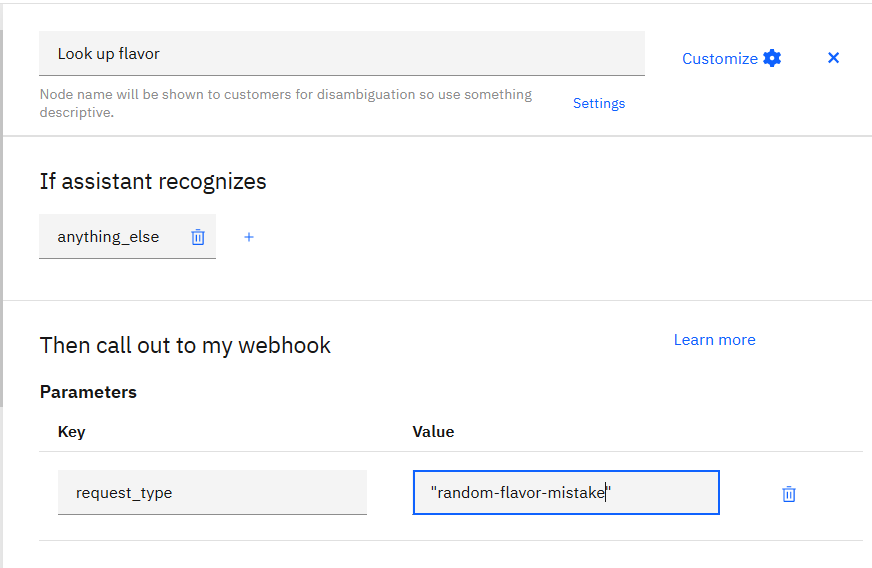
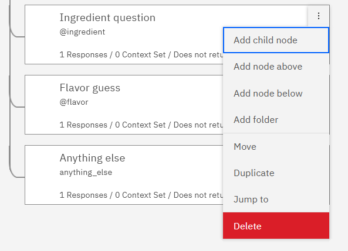

# Section C: Use a webhook to access the ice cream knowledge base

Full instructions:
- [Step 1: Configure the webhook](#step-1-configure-the-webhook)
- [Step 2: Look up a flavor to start the game](#step-2-look-up-a-flavor-to-start-the-game)
- [Step 3: Set the FLAVOR environment variable](#step-3-set-the-flavor-environment-variable)
- [Step 4: Answer color question](#step-4-answer-color-question)
- [Step 5: Answer ingredient question](#step-5-answer-ingredient-question)

&nbsp;

## Step 1: Configure the webhook

### 1.1 About the ice cream knowledge base
The ice cream knowledge base is a web service deployed on IBM Cloud.  It was created to support building ice cream guessing game playing chatbots.

See: [The ice cream knowledge base](./README-ice-cream-info.md)

### 1.2 Add webhook
<ol>
<li>

In the Watson Assistant GUI, navigate to <b>Options > Webhooks</b>

</li>
<li>

In the url field, paste: <code>https://ice-cream-info.mybluemix.net</code>

</li>
<li>

Click <b>Add header</b>

</li>
<li>

In the <b>Header name</b> field, paste: <code>Authorization</code>

</li>
<li>

In the <b>Basic authorization</b> modal that pops up, paste these values:

<ul>
<li>In the <b>User name</b> field, paste: <code>chatbot</code></li>
<li>In the <b>Password</b> field, paste the token shared at the beginning of the workshop.</li>
</ul>
</li>
<li>

Click <b>Save</b>

</li>
</ol>

&nbsp;

<table>
<tr>
<td>
<h3>Chatbots in content strategy</h3>

The strength of chatbots is their ability to structure the conversation:

<ul>
<li>Classify input to understand what kind of interaction the user wants to have with the chatbot (ie. recognize intent.)</li>
<li>Extract entities to understand what someone is talking about specifically.</li>
<li>The if-then-else of the dialog tree steers the conversation.</li>
</ul>

What chatbots are not good for is: knowing anything or complex processing.

For all but very simple cases, it's not practical to implement answers in the chatbot itself.  Instead, your chatbot needs to go find information to return to the user (eg. search.)  Or they need to call out to an external program to perform complex processing.

</td>
</tr>
</table>

&nbsp;

## Step 2: Look up a flavor to start the game

### 2.1 Add child node to the "Welcome" node
<ol>
<li>

Add a child node to the "Welcome" node: 

</li>
<li>

Name the child node something like: <code>Look up flavor</code>

</li>
<li>

Set the <b>If assistant recognizes</b> condition of the child node to: <code>anything_else</code>

</li>
<li>

Click <b>Customize</b>: 

</li>
<li>

Toggle "Call out to webhook" on: 

</li>
<li>

Click <b>Apply</b>

</li>
<li>

In the <b>Then call out to my webhooks</b> section, add a parameter:

<ul>
<li><b>Key</b>: <code>request_type</code></li>
<li><b>Value</b>: <code>random-flavor</code></li>
</ul>
</li>
<li>

Name the <b>Return variable</b>: <code>webhook_result_random-flavor</code>

</li>
<li>

In the <b>Assistant responds</b> section, paste the return variable in both the <b>If assistant recognizes</b> field and the <b>Respond with</b> field.  This will cause the raw result from the webhook to be shown.

</li>
</ol>

### 2.2 Update the "Welcome" node
<ol>
<li>

Update the <b>Assistant responds</b> section of the "Welcome" dialog node to a single line, like: <code>I'm thinking of a flavor of ice cream ...</code>

</li>
<li>

Update the <b>Then assistant should</b> section to: <b>Skip user input</b>

</li>
</ol>

&nbsp;

<table>
<tr>
<td>
<h3>Conversation design</h3>

The purpose of the "Welcome" node will be to print a message indicating what's going on (a call out to a webhook is happening.)  That provides some context for what comes next, whether it's a successful scenario or an error scenario.

Success scenario:

<pre>I'm thinking of an ice cream flavor ...
Ask me up to 5 Yes-or-No questions about color or ingredients, and then try to guess the flavor.
</pre>

Error scenario:

<pre>I'm thinking of an ice cream flavor ...
Looking up a flavor failed.  Try restarting the chat.
</pre>

This is one way to provide <b><i>transparency</i></b> in your chatbot: <i>"This is what's happening now."</i>

</td>
</tr>
</table>

&nbsp;

### 2.3 Call webhook and print debug
Click **Try it** and see the raw result returned from the webhook

&nbsp;

## Step 3: Set the FLAVOR environment variable

### 3.1 Create flavor look up success grandchild node
<ol>
<li>

Add a child node to the "Look up flavor" node.

</li>
<li>

Name the new node something like: <code>Look up flavor success</code>

</li>
<li>

In the <b>If assistant recognizes</b> section, specify <code>$webhook_result_random-flavor</code> and <code>$webhook_result_random-flavor.flavor</code>.  This means the dialog node should fire when there is a response from the flavor look-up webhook call and the result includes the field "flavor".

</li>
<li>

In the <b>Assistant responds</b> section, open the context editor:

</li>
<li>

In the <b>Then set context</b> section, define the <b>Variable</b> named <code>$FLAVOR</code> and set it to the <b>Value</b>: <code>$webhook_result_random-flavor.flavor</code>.  This sets a chatbot environment variable, called <code>$FLAVOR</code>, to the flavor that was returned by the webhook call.

</li>
<li>

In the <b>Assistant responds</b> section, enter a response that would make sense following your "Welcome" message in a successful flavor look up case.  Basically: Start the game!

</li>
</ol>

### 3.2 Create flavor look up error grandchild node
<ol>
<li>

Create another child node of the "Look up flavor" dialog node, below the "Look up flavor success" node just created.

</li>
<li>

In the <b>If assistant recognizes</b> section, specify <code>anything_else</code>.  This means that if the webhook call did not return a successful result, this error dialog node should fire.

</li>
<li>

In the <b>Assistant responds</b> section, enter a response that would make sense following your "Welcome" message in a failed flavor look up case.  Basically: You've hit an error right out of the gate and you can't even start the game.  So maybe reload the chatbot?

</li>
</ol>

### 3.3 Update the "Look up flavor" node
<ol>
<li>

In the <b>Assistant responds</b> section, delete all responses.

</li>
<li>

In the <b>Then assistant should</b> section, select <b>Skip user input</b>.

</li>
</ol>

### 3.4 Test success case
<ol>
<li>

When you click <b>Try it</b>, if the webhook call is successful, you'll see:

<ul>
<li>The message from the "Welcome" node, before the webhook call</li>
<li>And the message from the "Look up flavor success" node, after a successful webhook return</li>
</ul>

</li>
<li>

Click <b>Manage Context</b> to see the chatbot environment variables. You'll see the variable you defined, <code>$FLAVOR</code> as well as system variables, like <code>$metadata</code>, and <code>$timezone</code>:

</li>
</ol>
   
### 3.5 [OPTIONAL] Test failure case
<ol>
<li>

Click the "Look up flavor" dialog node to edit it.

</li>
<li>

In the <b>Then call out to my webhook</b> section, in the <b>Value</b> field, intentionally specify an invalid value, like: <code>random-flavor-mistake</code>.  Specifying an invalid value will cause the webhook call to fail.

</li>
<li>

When you click <b>Try it</b> this time, you'll see:

<ul>
<li>The message from the "Welcome" node, before the webhook call</li>
<li>And the message from the "Look up flavor fail" node, after the webhook call fails</li>
</ul>

</li>
</ol>

&nbsp;

## Step 4: Answer color question
In Step 4, we're going to copy the pattern established with the "Welcome" node:

### 4.1 Look up color answer
<ol>
<li>

Add a child node to the "Color question" node

</li>
<li>

Name the child node something like: <code>Look up color answer</code>

</li>
<li>

Set the <b>If assistant recognizes</b> condition of the child node to: <code>anything_else</code>

</li>
<li>

Click <b>Customize</b>, then toggle on "Call out to webhook", and then click <b>Apply</b>.

</li>
<li>

In the <b>Then call out to my webhooks</b> section, add a parameters:

<table>
<tr><td><b>Key</b></td><td><b>Value</b></td></tr>
<tr><td><code>request_type</code></td><td><code>lookup</code></td></tr>
<tr><td><code>flavor</code></td><td><code>$FLAVOR</code></td></tr>
<tr><td><code>property</code></td><td><code>&lt;? entities[0].entity ?></code></td></tr>
<tr><td><code>value</code></td><td><code>&lt;? entities[0].value ?></code></td></tr>
</table>
</li>
<li>

Name the <b>Return variable</b>: <code>webhook_result_color-lookup</code>

</li>
<li>

In the <b>Assistant responds</b> section, paste the return variable, <code>$webhook_result_color-lookup</code>, in both the <b>If assistant recognizes</b> field and the <b>Respond with</b> field.  This will cause the raw result from the webhook to be shown.

</li>
<li>

Update the "Color question" dialog node:

<ul>
<li>Change the <b>Assistant responds</b> section of the "Color question" dialog node to a single line: 
<code>Looking up &lt;? entities[0].entity ?> : &lt;? entities[0].value ?> ...</code></li>
<li>Update the <b>Then assistant should</b> section to: <b>Skip user input</b></li>
</ul>
</li>
<li>

Click <b>Try it</b>, clear previous results, and then ask the chatbot about a color":

</li>
</ol>

&nbsp;

<table>
<tr>
<td>
<h3>Conversation design</h3>

In support chatbot logs, we can see users experimenting with what they input to try to get the chatbot to give the desired answer.  If a user asks how to install a Db2 client, but the chatbot returns links to instructions for installing the Db2 server, users get frustrated because they can't figure out why the chatbot returned what it did or how to get the answer they need.

<b>Example 1</b>

In the following ice cream example, the chatbot answers make no sense:

<pre>
[User]
Does it have pink bubblegum?
                                         [Chatbot] 
                                         Yes
[User]
Is the flavor Bubblegum Ice Cream?
                                         [Chatbot] 
                                         Good try!  
                                         The flavor was: Strawberry.
</pre>

<b>Example 2</b>

In this example, the flavor is the same and the user asks the same question, but one thing is changed:

<pre>
[User]
Does it have pink bubblegum?
                                         [Chatbot] 
                                         Looking up color : pink ...
                                         Yes
[User]
Does it have bubblegum?
                                         [Chatbot] 
                                         Looking up ingredient : bubblegum ...
                                         No
</pre>

Because of the "Looking up ..." message, you can see the chatbot grabs the color pink and looks up the answer to the wrong question.

The user can see what went wrong and why, and the user can tell how to change their input to cause the chatbot to behave differently.

This is one way to provide <b><i>explainability</i></b> in your chatbot: <i>"This is how I arrived at my answer."</i>

</td>
</tr>
</table>

&nbsp;

### 4.2 Handle success and failure
<ol>
<li>

Add a child node to the "Look up color answer" node for the success case:

<ul>
<li>Named the new node something like: <code>Look up color answer success</code></li>
<li>In the <b>If assistant recognizes</b> section, specify <code>$webhook_result_color-lookup</code> and <code>$webhook_result_color-lookup.match</code></li>
<li>In the <b>Assistant responds</b> section, return the webhook answer: <code>$webhook_result_color-lookup.match</code></li>
</ul>
</li>
<li>

Add a node below the "Look up color answer success" node for the failure case:

<ul>
<li>Named the new node something like: <code>Look up color answer fail</code></li>
<li>In the <b>If assistant recognizes</b> section, specify <code>anything_else</code></li>
<li>In the <b>Assistant responds</b> section, type an answer that would make sense.  basically: explain that looking up the answer to the question failed, and suggest the user try asking the question again or in a different way.</li>
</ul>
</li>
<li>

Update the "Look up color answer" node:

<ul>
<li>In the <b>Assistant responds</b> section, delete all responses.</li>
<li>In the <b>Then assistant should</b> section, select <b>Skip user input</b>.</li>
</ul>
</li>
<li>

Test the success case (optional: test the failure case too.)

</li>
</ol>

&nbsp;

## Step 5: Answer ingredient question
In Step 5, we're going to generalize the "Color question" dialog node and children to work for both color questions and ingredient questions.
<ol>
<li>

Refactor the "Color question" node:

<ul>
<li>Change the name to: <code>Property question</code></li>
<li>Change the <b>If assistant recognizes</b> condition to: <code>@color</code> or <code>@ingredient</code></li>
</ul>

   
</li>
<li>

Refactor the "Look up color answer" node:

<ul>
<li>Change the name to: <code>Look up property answer</code></li>
<li>Change the <b>Return variable</b> name to: <code>$webhook_result_property-lookup</code></li>
</ul>

   
</li>
<li>

Refactor the "Look up color answer success" node:

<ul>
<li>Change the name to: <code>Look up property answer success</code></li>
<li>Change the <b>If assistant recognizes</b> condition to: <code>$webhook_result_property-lookup</code> and <code>$webhook_result_property-lookup.match</code></li>
<li>Change the response in <b>Assistant responds</b> to: <code>$webhook_result_property-lookup.match</code></li>
</ul>

   
</li>
<li>

Refactor the "Look up color answer fail" node:

<ul>
<li>Change the name to: <code>Look up property answer fail</code></li>
<li>Double check that the response in <b>Assistant responds</b> still makes sense.</li>
</ul>
</li>
<li>

Delete the "Ingredient question" node

</li>
</ol>

Try out your chatbot by asking questions about color and questions about ingredients:

   

&nbsp;

<table>
<tr>
<td>
<h3>Alternative webhook success and failure handling</h3>

You can implement success and failure handling in the same dialog node that calls the webhook, instead of creating grandchild nodes.

<ul>
<li>The advantage to this implementation choice is that it streamlines the dialog tree (fewer nodes.)</li>
<li>The disadvantage is that you cannot see the success and failure handling at a glance when viewing the dialog tree.  To view the success and error handling, you have to edit the dialog node where the webhook is called, and then click a gear icon beside each response in the <b>Assistant responds</b> section to view the details in a modal.</li>
</ul>
<table>
<tr>
<td valign="top">
<b>Verbose method</b>
</td>
<td valign="top">
<b>Streamlined method</b>
</td>
</tr>
</td>
</tr>
</table>

&nbsp;

