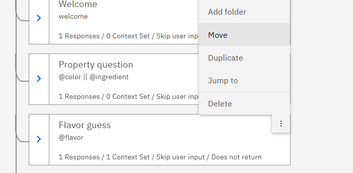
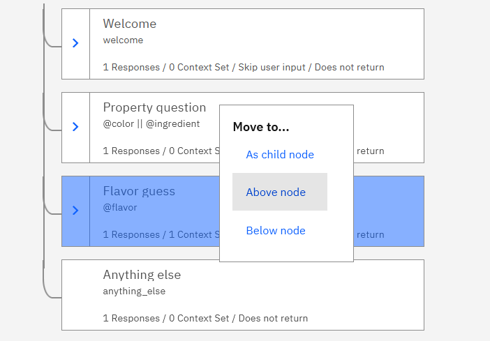
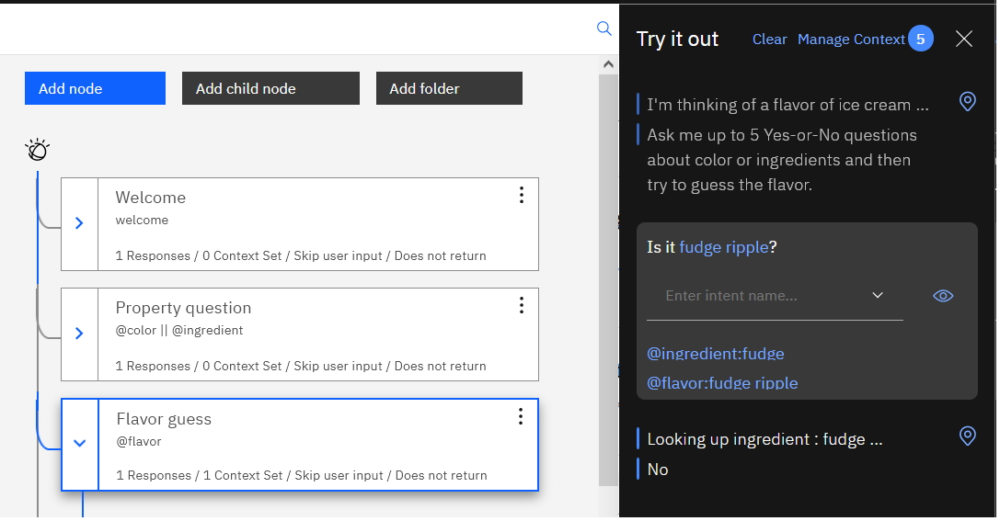
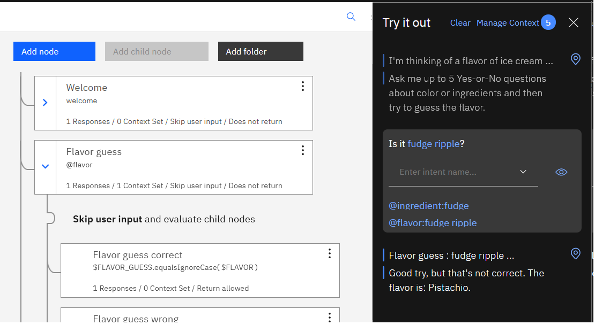
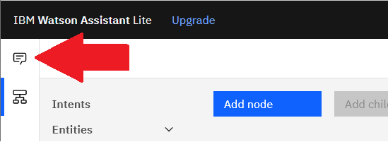
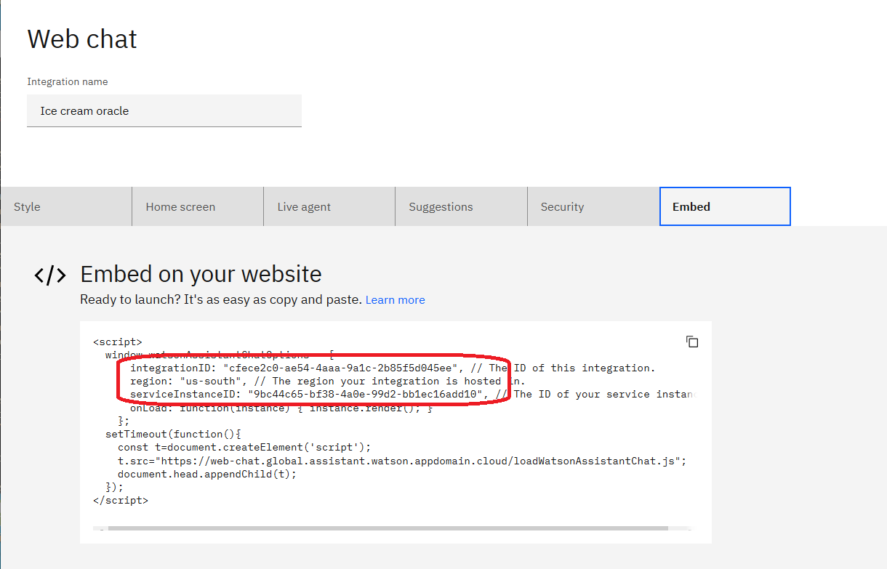

# Section D: Implement game play and deploy

See: [Section D demo video]()

Full instructions:
- [Step 1: Count the yes-or-no questions](#step-1-count-the-yes-or-no-questions)
- [Step 2: Validate the flavor guess and end the game](#step-2-validate-the-flavor-guess-and-end-the-game)
- [Step 3: Deploy chatbot to a web page](#step-3-deploy-chatbot-to-a-web-page)

&nbsp;

## Step 1: Count the yes-or-no questions

### 1.1 Set $QUESTION_COUNT at the start of the game
<ol>
<li>

In the "Welcome" dialog node, open the context editor.

</li>
<li>

In the <b>Then set context</b> section, add a variable, named <code>$QUESTION_COUNT</code> with a value of: <code>0</code>

</li>
</ol>

### 1.2 Increment $QUESTION_COUNT with each property question
<ol>
<li>

In the "Property question" node, open the context editor.

</li>
<li>

In the <b>Then set context</b> section, set the variable <code>$QUESTION_COUNT</code> to: <code>&lt;? $QUESTION_COUNT + 1 ?></code>
</li>
<li>

Remove all responses from the <b>Assistant responds</b> section (makes step 3.3 easier.)
</li>
</ol>

### 1.3 Don't accept more than 5 questions
<ol>
<li>

Add a "Too many questions asked" node:

<ol>
<li>Add a child node to the "Property question" node</li>
<li>Name the new node something like: <code>Too many questions asked</code></li>
<li>In the <b>If assistant recognizes</b> section, enter: <code>$QUESTION_COUNT > 5</code></li>
<li>In the <b>Assistant responds</b> section, specify some polite text telling the user they have already asked 5 Yes-or-No questions and prompt them to guess the flavor.</li>
</ol>

</li>
<li>

Add a "Proceed to look up answer" node:

<ol>
<li>Add a node under the "Too many questions asked" node</li>
<li>Name the new node something like: <code>Proceed to look up answer</code></li>
<li>In the <b>If assistant recognizes</b> section, enter the special condition <code>anything_else</code></li>
<li>In the <b>Assistant responds</b> section, paste the status message from the "Property question" node: <code>Looking up &lt;? entities[0].entity ?> : &lt;? entities[0].value ?> ...</code></li>
</ol>

</li>
<li>

Move the "Look up property answer" node to be a child of the "Proceed to look up answer" node.

</li>
<li>

In the <b>Then assistant should</b> section of the "Proceed to look up answer" node, select <b>Skip user input</b>.

</li>
</ol>

&nbsp;

## Step 2: Validate the flavor guess and end the game

### 2.1 Save the flavor guess value
<ol>
<li>

In the <b>Assistant responds</b> section of the "Flavor guess" node, open the context editor.

</li>
<li>

Add a variable, named <code>$FLAVOR_GUESS</code>, with a value of: <code>"&lt;? entities['flavor'][0].value ?>"</code>

</li>
<li>

Update the response text to: <code>Flavor guess : $FLAVOR_GUESS ...</code>

</li>
</ol>

&nbsp;

<table>
<tr>
<td>
<h3>Disambiguation strategy: Be specific with expressions</h3>

Notice here we use the more specific expression <code>entities['flavor'][0].value</code> instead of the generic expression we were using before, <code>entities[0].value</code>.

</td>
</tr>
</table>

&nbsp;

### 2.2 Create "Flavor guess correct" child node
<ol>
<li>

Create a child node of the "Flavor guess" node.

</li>
<li>

Name the new node something like: <code>Flavor guess correct</code>

</li>
<li>

In the <b>If assistant recognizes</b> section, enter the condition: <code>$FLAVOR_GUESS.equalsIgnoreCase( $FLAVOR )</code>

This string expression function performs a case-insensitive comparison of the user's matched flavor guess and the $FLAVOR variable set at the start of the case.  For more details, see: <a href="https://cloud.ibm.com/docs/assistant?topic=assistant-dialog-methods#dialog-methods-strings-equals-ignore-case">String.equalsIgnoreCase(String)</a>

</li>
<li>

In the <b>Assistant responds</b> section, enter a cheerful response indicating the user won the game.

</li>
</ol>

### 2.3 Create "Flavor guess wrong" child node
<ol>
<li>

Create another child node of the "Flavor guess" node.

</li>
<li>

Name the new node something like: <code>Flavor guess wrong</code>

</li>
<li>

In the <b>If assistant recognizes</b> section, enter the special condition <code>anything_else</code>

</li>
<li>

In the <b>Assistant responds</b> section, enter a polite response indicating the user didn't win the game.  Don't keep the user forever wondering, do tell them what the flavor was.

</li>
</ol>

### 2.4 Update "Flavor guess" node to skip to child nodes
In the <b>Then assistant should</b> section, select <b>Skip user input</b>.

### 2.5 Test guessing the flavor
Click **Try it** and then guess some flavors, such as: `Rocky road` or `Tiger tail`

Also try some ambiguous flavor names, like: `Cookies and cream` or `Red velvet cake`

### 2.6 Move "Flavor guess" above "Property question"
Many flavor entity values contain color or ingredient entities:
- Flavor "Banana cream pie" contains the ingredient "banana" and the color "cream"
- Flavor "Fudge ripple" contains the ingredient "fudge"
- Flavor "Cookie dough" contains the ingredient "cookie" and the ingredient "dough"

However, not many ingredient entity values contain flavor entities, and no color entity values contain flavor entities.

So, it's not a bad strategy to design our dialog tree based on this assumption: If a user's input contains a flavor entity, they are more likely to be guessing the flavor than to be asking a Yes-or-No question about color or ingredients.

<ol>
<li>

On the "Flavor guess" node, open the menu and select "Move": 

</li>
<li>

Click on the "Property question" node, and then select "Above node": 

</li>
</ol>

&nbsp;

<table>
<tr>
<td>
<h3>Disambiguation strategy: Ordering of dialog nodes</h3>

When input matches the if-condition for more than one dialog node, the order of the nodes will determine which match gets the preference.

</td>
</tr>
<tr>
<td>
<table>
<tr>
<td valign="top">
<b>Property before flavor</b>

</td>
<td valign="top">
<b>Flavor before property</b>

</td>
</tr>
</table>
</tr>
</table>

&nbsp;

## Step 3: Deploy chatbot to a web page

### 3.1 Create an integration
<ol>
<li>

Navigate to the <b>Assistants</b> page by clicking the icon in the upper-left corner:

</li>
<li>

On the <b>Assistants</b> page, click on the assistant you created for this workshop series.

</li>
<li>

If there are no skills associated with your assistant, click <b>Add an action or dialog skill</b> and then click on the skill you have been working on today.

</li>
<li>

On the <b>Assistants</b> page, under the <b>Integrations</b> menu (lower, right-hand corner of the page), click <b>Integrate web chat</b>.

</li>
<li>

Click <b>Create</b>.

</li>
</ol>

### 3.2 Customize the integration
<ol>
<li>

On the <b>Style</b> tab of the <b>Web chat</b> page, enter a unique name in the <b>Assistant's name as known by customers</b> field.

</li>
<li>

On the <b>Home screen</b> tab, toggle the home screen off.

</li>
<li>

On the <b>Suggestions</b> tab, toggle suggestions off.

</li>
<li>

Click <b>Save and exit</b> to save your new integration.

</li>
</ol>

**Note**: Open your new integration again, and navigate to the <b>Embed</b> tab, because you will need information on that page for the next step.

### 3.3 Run your chatbot in a web page
<ol>
<li>

Download this sample file: <a href="index.html"><code>index.html</code></a>

<i>Note about downloading an individual file in GitHub:</i> Open that link in a new tab, click <b>Raw</b>, then right-click on the page and select "Save Page As ...". Save the file with the extension <code>.html</code>

</li>
<li>

In a text editor on your local computer, update <code>index.html</code> with details from the <b>Embed</b> tab of the <b>Web chat</b> page in Watson Assistant:

<ul>
<li><code>integrationID</code></li>
<li><code>region</code></li>
<li><code>serviceInstanceID</code></li>
</ul>

</li>
<li>

Open <code>index.html</code> in a web browser on your local computer.

</li>
<li>

Click the chatbot icon in the lower-right corner of the web page to start the chat and play the game.

</li>
</ol>

&nbsp;

