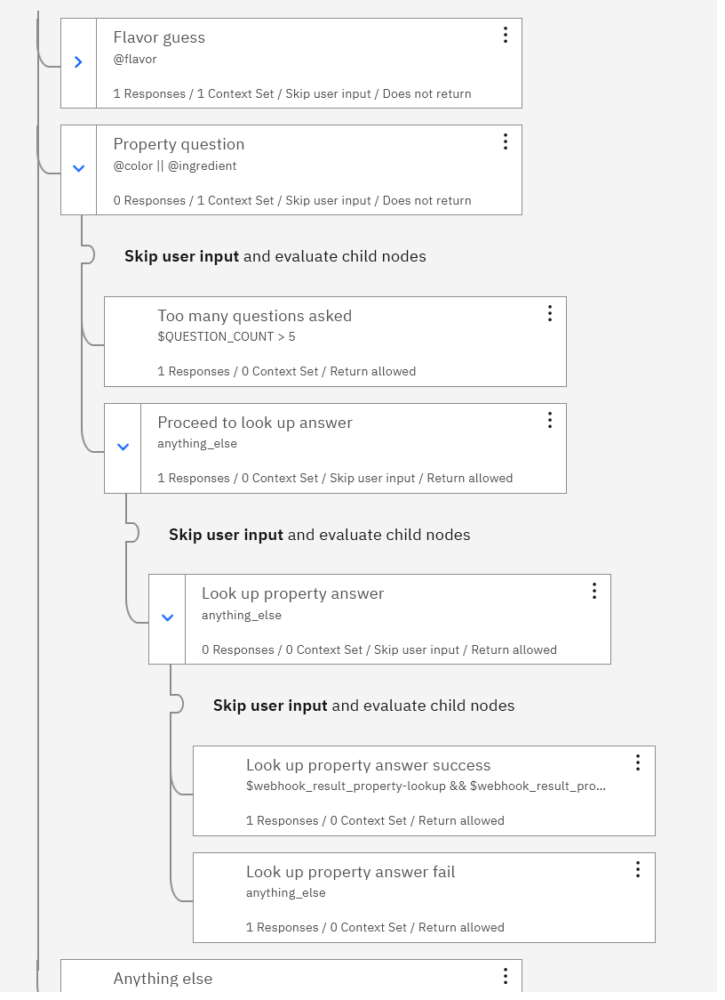

# Section D: Count the yes-or-no questions

See: [Section D demo video]()

Full instructions:
- [Step 1: Count the yes-or-no questions](#step-1-count-the-yes--or--no-questions)
- [Step 2: Validate the flavor guess and end the game](#step-2-validate-the-flavor-guess-and-end-the-game)
- [Step 3: Deploy chatbot to a web page](#step-3-deploy-chatbot-to-a-web-page)

&nbsp;

## Step 1: Count the yes-or-no questions

### 1.1 Set $QUESTION_COUNT at the start of the game
<ol>
<li>

In the "Welcome" dialog node, open the context editor.

</li>
<li>

In the <b>Then set context</b> section, add a variable, named <code>$QUESTION_COUNT</code> with a value of: <code>0</code>

</li>
</ol>

### 1.2 Increment $QUESTION_COUNT with each property question
<ol>
<li>

In the "Property question" node, open the context editor.

</li>
<li>

In the <b>Then set context</b> section, set the variable <code>$QUESTION_COUNT</code> to: <code>&lt;? $QUESTION_COUNT + 1 ?></code>
</li>
<li>

Remove all responses from the <b>Assistant responds</b> section (makes step 3.3 easier.)
</li>
</ol>

### 1.3 Don't accept more than 5 questions
<ol>
<li>

Add a "Too many questions asked" node:

<ol>
<li>Add a child node to the "Property question" node</li>
<li>Name the new node something like: <code>Too many questions asked</code></li>
<li>In the <b>If assistant recognizes</b> section, enter: <code>$QUESTION_COUNT > 5</code></li>
<li>In the <b>Assistant responds</b> section, specify some polite text telling the user they have already asked 5 Yes-or-No questions and prompt them to guess the flavor.</li>
</ol>

</li>
<li>

Add a "Proceed to look up answer" node:

<ol>
<li>Add a node under the "Too many questions asked" node</li>
<li>Name the new node something like: <code>Proceed to look up answer</code></li>
<li>In the <b>If assistant recognizes</b> section, enter the special condition <code>anything_else</code></li>
<li>In the <b>Assistant responds</b> section, paste the status message from the "Property question" node: <code>Looking up &lt;? entities[0].entity ?> : &lt;? entities[0].value ?> ...</code></li>
</ol>

</li>
<li>

Move the "Look up property answer" node to be a child of the "Proceed to look up answer" node.

</li>
<li>

In the <b>Then assistant should</b> section of the "Proceed to look up answer" node, select <b>Skip user input</b>.

</li>
</ol>

&nbsp;

## Step 2: Validate the flavor guess and end the game

&nbsp;

## Step 3: Deploy chatbot to a web page

&nbsp;

