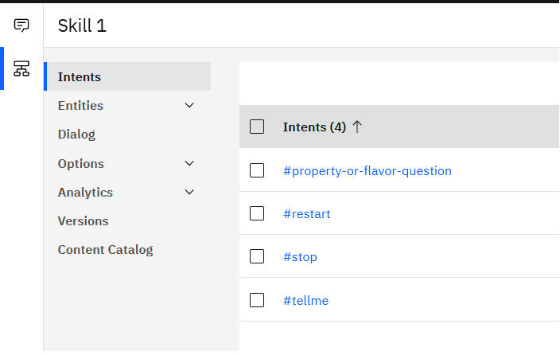
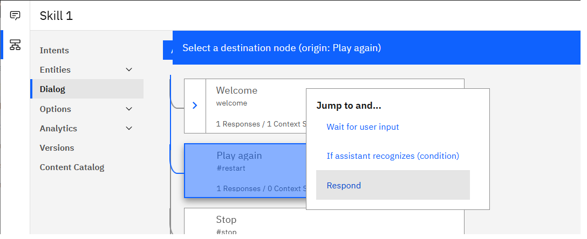
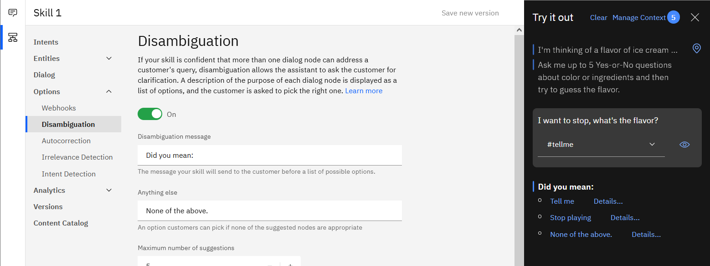
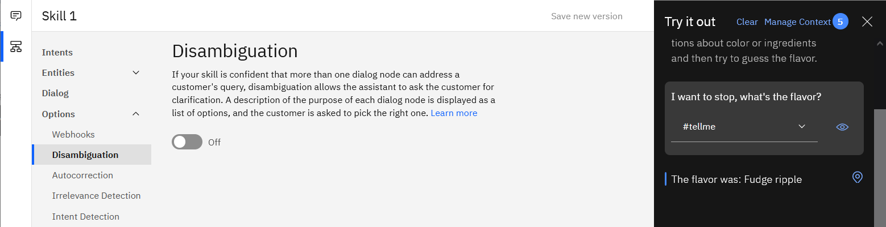
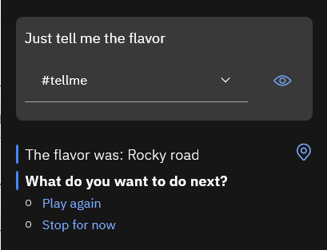
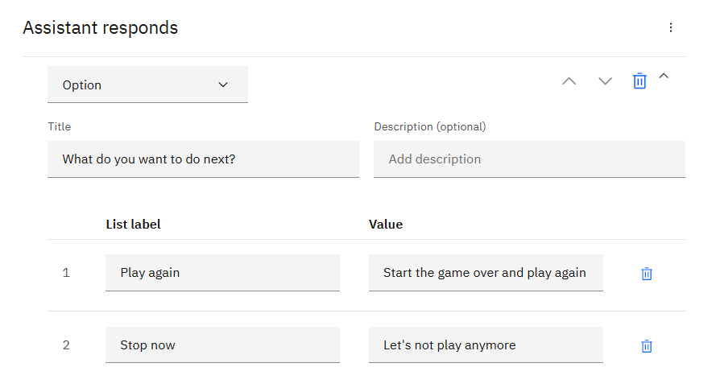
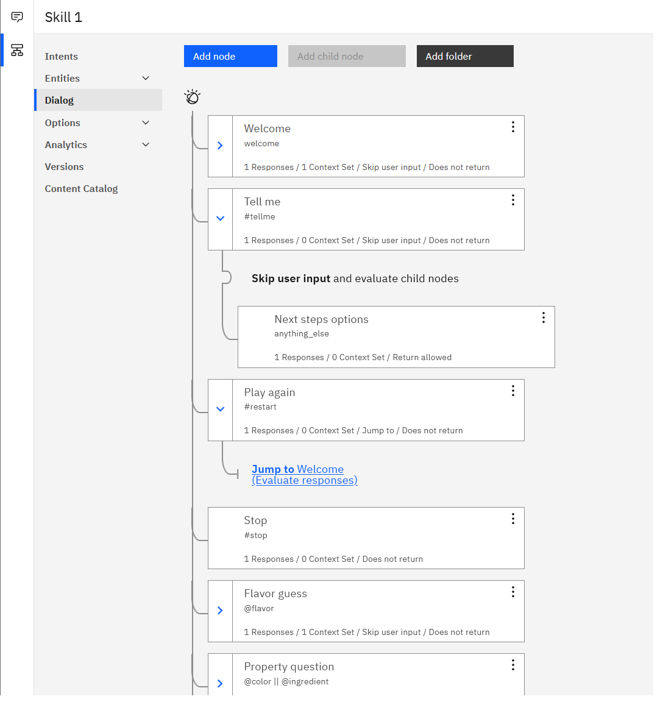
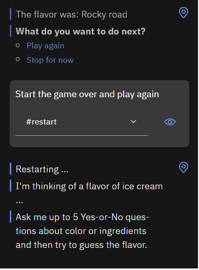
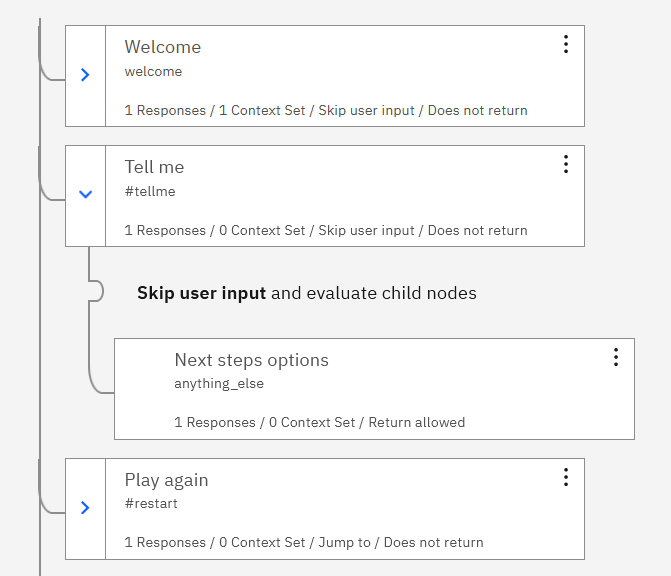
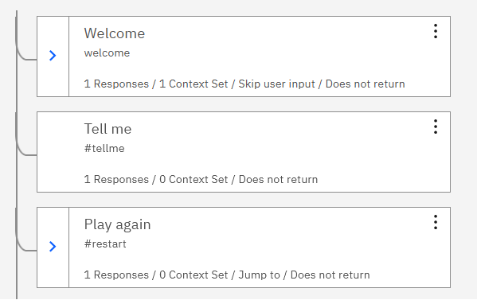

# Section E: Bonus fun!

See: [Section E demo video]()

Full instructions:
- [Step 1: Game play variations with intents](#step-1-game-play-variations-with-intents)
- [Step 2: Give users options](#step-2-give-users-options)
- [Step 3: Implement a Player B chatbot](#step-3-implement-a-player-B-chatbot)
- [Step 4: Chabot vs. chatbot](#step-4-chabot-vs-chatbot)

&nbsp;

## Step 1: Game play variations with intents

### 1.1 Define intents
<ol>
<li>

Download this file: <a href="intents.csv"><code>intents.csv</code></a>.

<i>Note about downloading an individual file in GitHub:</i> Open that link in a new tab, click <b>Raw</b>, then right-click on the page and select "Save Page As ...". Save the file with the extension <code>.csv</code>

</li>
<li>

In Watson Assistant, click the <b>Intents</b> menu.

</li>
<li>

On the <b>Intents</b> page, click <b>Upload intents</b>.

</li>
<li>

In the modal that appears, specify the file <code>intents.csv</code>, and then click <b>Upload</b>.

</li>
</ol>

### 1.2 Create dialog node to handle `#stop` intent
<ol>
<li>

Add a node below the "Welcome" node

</li>
<li>

Name the new node something like: <code>Stop playing</code>

</li>
<li>

In the <b>If assistant recognizes</b> section, specify: <code>#stop</code>

</li>
<li>

In the <b>Assistant responds</b> enter a text reply, such as: <code>Thanks for playing. Bye!</code>

</li>
<li>

Click <b>Try it</b>, ask a few Yes-or-No questions, and then see what happens when you input something like: "I don't want to play anymore."

</li>
</ol>

### 1.3 Create dialog node to handle `#restart` intent
<ol>
<li>

Add another node below the "Welcome" node and above the "Stop playing" node.

</li>
<li>

Name the new node something like: <code>Play again</code>

</li>
<li>

In the <b>If assistant recognizes</b> section, specify: <code>#restart</code>

</li>
<li>

In the <b>Assistant responds</b> enter a text reply indicating what's happening: <code>Restarting ...</code>

</li>
<li>

In the <b>Then assistant should</b> section, select <b>Jump to</b>. When prompted, click the "Welcome" node and then select <b>Respond</b>.  This causes the "Welcome" node to fire without testing the if-condition of the "Welcome" node.

</li>
<li>

Click <b>Try it</b>, ask a few Yes-or-No questions, and then see what happens when you input something like: "I give up!"

</li>
</ol>

### 1.4 Create dialog node to handle `#tellme` intent
<ol>
<li>

Add a node below the "Welcome" node and above the "Play again" node

</li>
<li>

Name the new node something like: <code>Tell me</code>

</li>
<li>

In the <b>If assistant recognizes</b> section, specify: <code>#tellme</code>

</li>
<li>

In the <b>Assistant responds</b> enter a text reply with the answer: <code>The flavor was: $FLAVOR</code>

</li>
<li>

Click <b>Try it</b>, ask a few Yes-or-No questions, and then see what happens when you input something like: "Oh just tell me what it is"

</li>
</ol>

&nbsp;

<table>
<tr>
<td>
<h3>Disambiguation feature</h3>

In the <b>Options &gt; Disambiguation</b> menu, you can toggle on or off a built-in disambiguation feature.  This feature fires when user input matches more than one intent with a high confidence.  When that happens, this feature prompts the user to select from a list of options that is generated from your chatbot's dialog nodes.

Demo video: <a href="https://ibm.box.com/s/sn5xbpc457583xvqn7id23zq1i9gybho">Disambiguation feature</a>

<b>Disambiguation ON</b>

<b>Disambiguation OFF</b>

</td>
</tr>
</table>

&nbsp;

## Step 2: Give users options
Using _options_ is another way to shape user behavior.  Options are presented to users in an unordered list in the chatbot interface, and users can click one of the options to move the conversation forward in a direction you have designed for:

Note: One down-side of options is that if you use too many, the chatbot can begin to feel less like a natural language interface and more like navigating a menu.

<ol>
<li>

Add a child node to the "Tell me" node.

<li>

Name the new node something like <code>Next steps options</code>

</li>
<li>
In the <b>If assistant recognizes</b> section, specify: <code>anything_else</code>

</li>
<li>

In the <b>Assistant responds</b> section, choose the response type <b>Option</b>

</li>
<li>

In the <b>Title</b> field, enter a user prompt, like: <code>What do you want to do next?</code>

</li>
<li>

Enter the following list items:

<table>
<tr><td><b>List label</b></td><td><b>Value</b></td></tr>
<tr><td>Play again</td><td>Start the game over and play again</td></tr>
<tr><td>Stop now</td><td>Let's not play anymore</td></tr>
</table>

</li>
<li>

In the <b>Then assistant should</b> section of the "Tell me" node, select <b>Skip user input</b>.

</li>
</ol>

&nbsp;

**Dialog tree with new nodes for intents and options**

&nbsp;

<table>
<tr>
<td>
<h3>How options are handled</h3>

When a user clicks one of the list items, it's as if the user had typed in whatever is specified in the <b>Value</b> field of that option.

So, if a user clicks the option labeled "Play again", it's as if the user had typed: "Start the game over and play again."  If a user types that, the chatbot classifies that input as #restart, and then works through the nodes in the dialog tree, starting from the top, until it hits the Play again node:

</td>
</tr>
</table>

&nbsp;

<table>
<tr>
<td>
<h3>Alternative options implementation</h3>

You can implement options in the "Tell me" dialog node with the answer message, instead of using a child node.

<ul>
<li>The advantage to this implementation choice is that it streamlines the dialog tree (fewer nodes.)</li>
<li>The disadvantage is that you cannot see the options handling at a glance when viewing the dialog tree.  To view the options, you have to edit the "Tell me" dialog node.</li>
<li>One reason why you might want to have the options in a separate node is so that you could jump to that node.</li>
</ul>

<b>Demo video:</b> <a href="https://ibm.box.com/s/12jeyb1r0glu9f6p4b57o61vuefdfizu">Streamlined options</a>

<table>
<tr>
<td valign="top">
<b>Verbose method</b>
</td>
<td valign="top">
<b>Streamlined method</b>
</td>
</tr>
</td>
</tr>
</table>

&nbsp;

## Step 3: Implement a Player B chatbot

&nbsp;

## Step 4: Chabot vs. chatbot

&nbsp;

