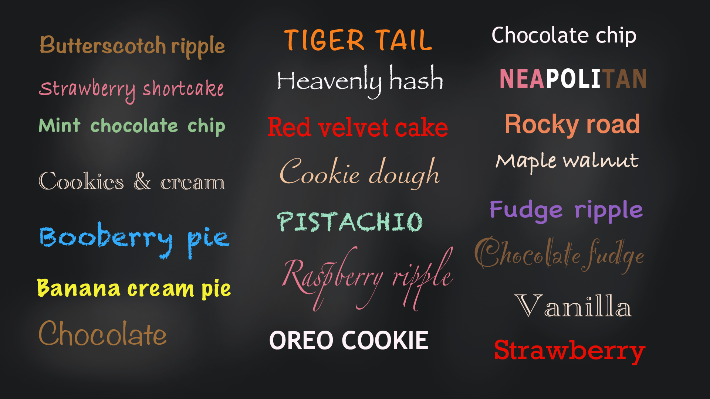
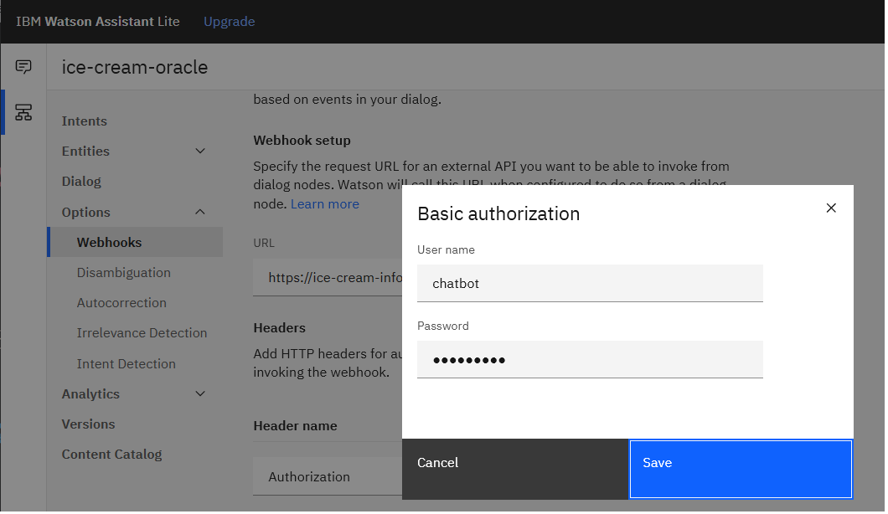
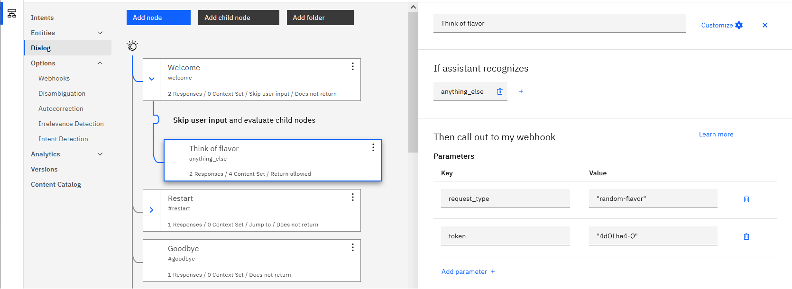
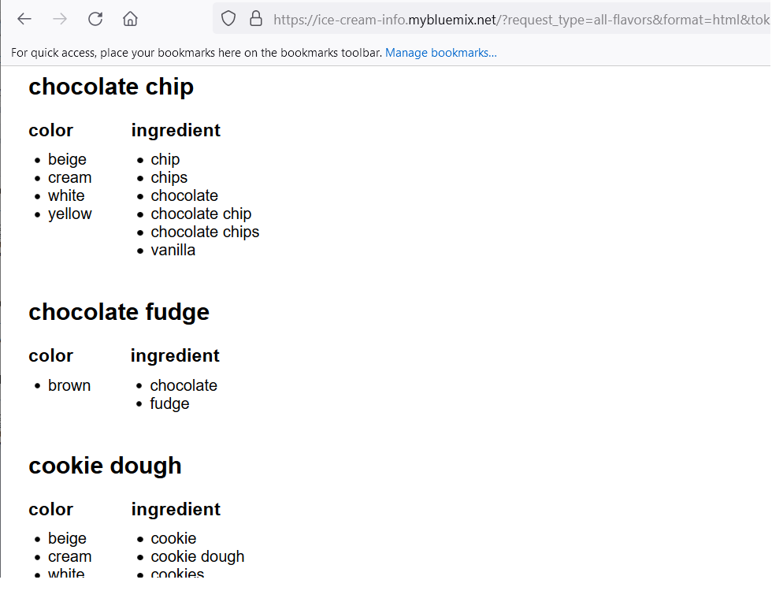

# ice-cream-info
The `ice-cream-info` web service was created to support chatbots that play an ice cream guessing game:
- Player A - _The ice cream oracle_ - Thinks of a flavor of ice cream
- Player B - _The guesser_ - Asks up to 5 yes-or-no questions and then guesses the flavor

<p>&nbsp;</p>


**Quick links**
<ul>
<li><a href="#flavors">Flavors</a></li>
<li><a href="#authorization">Authorization</a></li>
<li><a href="#watson-assistant">Watson Assistant</a></li>
<li>
<a href="#player-a---the-ice-cream-oracle">Player A - The ice cream oracle</a>
<ul>
<li><a href="#think-of-a-flavor">Think of a flavor</a></li>
<li><a href="#look-up-a-property">Look up a property</a></li>
</ul>
</li>
<li><a href="#player-b---the-guesser">Player B - The guesser</a>
<ul>
<li><a href="#guess-the-flavor">Guess the flavor</a></li>
</ul>
</li>
<li><a href="#error-handling">Error handling</a></li>
<li><a href="#miscellaneous">Miscellaneous</a>
<ul>
<li><a href="#list-known-flavors">List known flavors</a></li>
</ul>
</li>
</ul>

<p>&nbsp;</p>


# Flavors
These are the flavors included in the `ice-cream-info` knowledge base:



Butterscotch ripple, Strawberry shortcake, Mint chocolate chip, Cookies & cream, Booberry pie, Banana cream pie, Chocolate, Tiger tail, Heavenly hash, Red velvet cake, Cookie dough, Pistachio, Raspberry ripple, Oreo cookie, Chocolate chip, Neapolitan, Rocky road, Maple walnut, Fudge ripple, Chocolate fudge, Vanilla, Strawberry.

<p>&nbsp;</p>


# Authorization
To use the `ice-cream-info` web service, you must be given a token.

A token will be shared with workshop participants at the beginning of the workshop.

The token will expire after the workshop.

Multiple methods of authorization are supported:
<ul>
<li>
<p>In GET requests, you can pass your token with a query parameter named `token`:</p>
<p>Example 1: Browser URL<br/>
<pre>https://ice-cream-info.mybluemix.net?token=yourtoken</pre></p>
<p>Example 2: Curl<br/>
<pre>curl "https://ice-cream-info.mybluemix.net?token=yourtoken"</pre></p>
</li>
<li>
<p>In POST requests, you can pass your token in the body with a parameter named `token`:</p>
<p>Example: Curl<br/>
<pre>curl -X POST "https://ice-cream-info.mybluemix.net" -d token=yourtoken</pre></p>
</li>
<li>
<p>In both GET requests and POST requests, you can pass your token using Basic authentication:</p>
<p>Example 1: Curl GET<br/>
<pre>curl -u chatbot:yourtoken "https://ice-cream-info.mybluemix.net"</pre></p>
<p>Example 2: Curl POST<br/>
<pre>curl -u chatbot:yourtoken -X POST "https://ice-cream-info.mybluemix.net"</pre></p>
</li>
</ul>

<p>&nbsp;</p>


# Watson Assistant

Watson Assistant chatbots can use a webhook to access the `ice-cream-info` web service with this endpoint:

`https://ice-cream-info.mybluemix.net`

The simplest way to specify your token is to use it as the password in the Authorization header:



Alternatively, you can specify your token as a parameter in the dialog node that calls out to the webhook:



<p>&nbsp;</p>


# Player A - The ice cream oracle
If your chatbot is an ice cream oracle, there are (at least) two ways you will need to use the `ice-cream-info` web service:
- `request_type=random-flavor`
- `request_type=lookup`

<p>&nbsp;</p>


## Think of a flavor
When your chatbot needs to "think of a flavor" at the start of the game, you can use: `request_type=random-flavor`.

**Parameters**
<table>
<tr>
<th>Parameter name</th>
<th>Details</th>
</tr>
<tr>
<td valign='top'><code>token</code></td>
<td valign='top'>
A token will be shared with workshop participants at the beginning of the workshop.
</td>
</tr>
<tr>
<td valign='top'><code>request_type</code></td>
<td valign='top'>
Specify: <code>random-flavor</code>
</td>
</tr>
</table>

**Result**

JSON results will include a field called `flavor`:
```
{
   "flavor": "Chocolate"
}
```

In the event of a server-side error (eg. database error), an attempt will be made to return the flavor "vanilla":
```
{
   "flavor": "Vanilla"
}
```

**Example**

GET
```
> curl "https://ice-cream-info.mybluemix.net?token=yourtoken&request_type=random-flavor"
{
   "flavor": "Chocolate"
}
```

POST
```
> curl -X POST https://ice-cream-info.mybluemix.net
  -d token=yourtoken
  -d request_type=random-flavor
{
   "flavor": "Chocolate"
}
```

<p>&nbsp;</p>


## Look up a property
When your chatbot needs to answer a guesser's yes-or-no question, you can look up whether a given property value is a match for the specified flavor by using: `request_type=lookup`.

For example, if an ice cream oracle chatbot is thinking of the flavor chocolate, and the guesser asks "Is it brown?", the answer should be "Yes".

**Note**: All string comparisons performed by the web service are case-insensitive.

**Parameters**
<table>
<tr>
<th>Parameter name</th>
<th>Details</th>
</tr>
<tr>
<td valign='top'><code>token</code></td>
<td valign='top'>
A token will be shared with workshop participants at the beginning of the workshop.
</td>
</tr>
<tr>
<td valign='top'><code>request_type</code></td>
<td valign='top'>
Specify: <code>lookup</code>
</td>
</tr>
<tr>
<td valign='top'><code>flavor</code></td>
<td valign='top'>
The flavor the ice cream oracle is thinking of, returned from <code>request_type=random-flavor</code> at the start of the game.
</td>
</tr>
<tr>
<td valign='top'><code>property</code></td>
<td valign='top'>
An ice cream property, such as <code>color</code>, or <code>ingredient</code>.
</td>
</tr>
<tr>
<td valign='top'><code>value</code></td>
<td valign='top'>
The value that the guesser asked about.  For example, if a guesser asks "Is it brown?", the property is <code>color</code> and the value is <code>brown</code>.
</td>
</tr>
</table>

**Result**

In a successful case, a field called `match` is returned with a value of "Yes" or "No".
```
{
   "match": "Yes"
}
```
```
{
   "match": "No"
}
```

If a match cannot be determined (for example, because the specified property isn't in the knowledge base or because of a database error) `match` will be "Unknown".
```
{
   "match": "Unknown"
}
```

**Example**

GET
```
> curl "https://ice-cream-info.mybluemix.net?token=yourtoken&request_type=lookup&flavor=chocolate&property=color&value=brown"
{
   "match": "Yes"
}
```

POST
```
> curl -X POST https://ice-cream-info.mybluemix.net
  -d token=yourtoken
  -d request_type=lookup
  -d flavor=chocolate
  -d property=color
  -d value=brown
{
   "match": "Yes"
}
```

<p>&nbsp;</p>


# Player B - The guesser
If your chatbot is the guesser, you will need to use the `ice-cream-info` web service in (at least) one way:
- `request_type=classify`

<p>&nbsp;</p>


## Guess the flavor
After your chatbot has collected yes-or-no answers for up to 5 questions, you can classify the ice cream flavor by using: `request_type=classify`.

**Note**: All string comparisons performed by the web service are case-insensitive.

**Parameters**
<table>
<tr>
<th>Parameter name</th>
<th>Details</th>
</tr>
<tr>
<td valign='top'><code>token</code></td>
<td valign='top'>
A token will be shared with workshop participants at the beginning of the workshop.
</td>
</tr>
<tr>
<td valign='top'><code>request_type</code></td>
<td valign='top'>
Specify: <code>classify</code>
</td>
</tr>
<tr>
<td valign='top'><code>property1</code></td>
<td valign='top'>
A property your chatbot asked about.
</td>
</tr>
<tr>
<td valign='top'><code>value1</code></td>
<td valign='top'>
The value your chatbot specified for the corresponding property.
</td>
</tr>
<tr>
<td valign='top'><code>match1</code></td>
<td valign='top'>
The yes-or-no answer your chatbot received from the ice cream oracle.
</td>
</tr>
<tr>
<td valign='top'><code>property2</code></td>
<td valign='top'>
Optional. If your chatbot asked only one question, you can omit this parameter, or specify an empty string.
</td>
</tr>
<tr>
<td valign='top'><code>value2</code></td>
<td valign='top'>
Optional. If your chatbot asked only one question, you can omit this parameter, or specify an empty string.
</td>
</tr>
<tr>
<td valign='top'><code>match2</code></td>
<td valign='top'>
Optional. If your chatbot asked only one question, you can omit this parameter, or specify an empty string.
</td>
</tr>
<tr>
<td valign='top' colspan='2'>...</td>
</tr>
<tr>
<td valign='top'><code>property5</code></td>
<td valign='top'>
Optional. If your chatbot asked fewer than five questions, you can omit this parameter, or specify an empty string.
</td>
</tr>
<tr>
<td valign='top'><code>value5</code></td>
<td valign='top'>
Optional. If your chatbot asked fewer than five questions, you can omit this parameter, or specify an empty string.
</td>
</tr>
<tr>
<td valign='top'><code>match5</code></td>
<td valign='top'>
Optional. If your chatbot asked fewer than five questions, you can omit this parameter, or specify an empty string.
</td>
</tr>
</table>

**Result**
The flavor that best fits with the specified collection of properties is returned.  The name of the flavor is in a field called `flavor`.

For explainability purposes, additional information is included:
- A confidence score of 0 - 100 is returned in a field called `confidence`
- The parameters property1, value1, match1, ..., property5, value5, match5 are returned with an extra field, named `fits1` to `fits5`, that indicates whether the property value is a perfect match for the returned flavor
- A array called `other_properties` that shows what properties the knowledge base knows about

**Example**

Imagine the ice cream oracle is thinking of "Heavenly Hash" ice cream.  When the guesser asked: "Is it white?" the oracle replied "Yes" (because there are multiple colors in Heavenly Hash ice cream.)  When the guesser asks "Are there nuts?" the oracle replied "Yes".  If the guesser submitted a classify request with only those two pieces of information, the response would be something like:
```
> curl -X POST https://ice-cream-info.mybluemix.net
  -d token=yourtoken
  -d request_type=classify
  -d property1=color
  -d value1=white
  -d match1=Yes
  -d property2=ingredient
  -d value2=nuts
  -d match2=Yes
{
   "flavor": "Pralines and cream",
   "confidence": 100,
   "property1": "color",
   "value1": "white",
   "match1": "Yes",
   "fit1": "Yes",
   "property2": "ingredient",
   "value2": "nuts",
   "match2": "Yes",
   "fit2": "Yes",
   "other_properties": [
      {
         "property": "ingredient",
         "values": [ "pralines" ]
      }
   ]    
}
```

<p>&nbsp;</p>


# Error handling
If a call to the `ice-cream-info` web service fails, standard HTTP status codes are returned.  See: [HTTP Status Codes](https://en.wikipedia.org/wiki/List_of_HTTP_status_codes)

If the `ice-cream-info` web service detects an error, the service will attempt to return a field named `error-str`.  Chatbots should check for this field, but it will not always be there.

**Example**
```
> curl -X POST https://ice-cream-info.mybluemix.net
  -d token=yourtoken
  -d request_type=classify
  -d property1=color
{
   "error-str": "value1 was not specified"
}
```

<p>&nbsp;</p>


# Miscellaneous
You might use `request_type=all-flavors` just to see what flavors there are in the knowledge base.  

Or you might design your chatbot to use the information in a creative way:
- An _ice cream oracle_ chatbot might use the information for dialogs like "Did you mean..?"
- A _guesser_ chatbot might use this information to decide what properties to ask about

<p>&nbsp;</p>


## List known flavors
To lists all the flavors in the ice cream knowledge base, use: `request_type=all-flavors`.

**Parameters**
<table>
<tr>
<th>Parameter name</th>
<th>Details</th>
</tr>
<tr>
<td valign='top'><code>token</code></td>
<td valign='top'>
A token will be shared with workshop participants at the beginning of the workshop.
</td>
</tr>
<tr>
<td valign='top'><code>request_type</code></td>
<td valign='top'>
Specify: <code>all-flavors</code>
</td>
</tr>
<tr>
<td valign='top'><code>format</code></td>
<td valign='top'>
Optional.  Only valid value: <code>html</code>
<p>By deault, output is in <code>JSON</code> format.  But if you specify <code>format=html</code> the output will be in HTML.</p>
</td>
</tr>
</table>

**Example**

GET
```
> curl "https://ice-cream-info.mybluemix.net?token=yourtoken&request_type=all-flavors"
{
   "flavors_arr": [
      {
         "flavor": "chocolate",
         "properties": [
            {
               "property": "color",
               "values": [
                  "brown"
               ]
            }
         ]
      }
}
```

POST
```
> curl -X POST https://ice-cream-info.mybluemix.net 
  -d token=yourtoken
  -d request_type=all-flavors
{
   "flavors_arr": [
      {
         "flavor": "vanilla",
         "properties": [
            {
               "property": "color",
               "values": [
                  "cream",
                  "white"
               ]
            }
         ]
      }
   ]
}
```



<p>&nbsp;</p>

