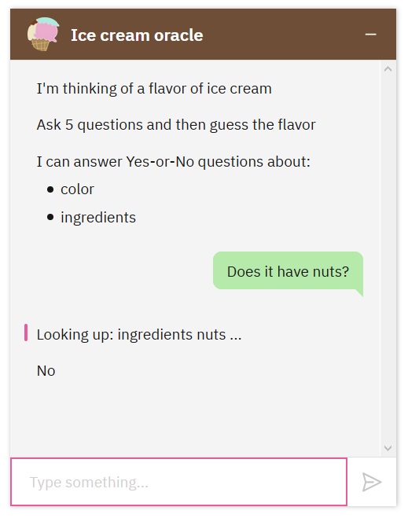

# CASCON 2021 Workshop

**Build a chatbot that can play an ice cream guessing game using IBM Watson Assistant**

Sarah Packowski - IBM ( spackows@ca.ibm.com ) 
Christopher Alfonso - IBM ( Christopher.Alfonso@ibm.com ) 
Noam Karakowsky - University of Ottawa ( nkarakow@gmail.com ) 
Parth Suthar - IBM - ( Parth.Suthar@ibm.com )

&nbsp;

## About the workshop
In this workshop, participants will use Watson Assistant to create a chatbot that can play an ice cream guessing game:
- Player A - _The ice cream oracle_ - Thinks of a flavor of ice cream
- Player B - _The guesser_ - Asks up to 5 yes-or-no questions and then guesses the flavor

In this workshop, participants will build a chatbot to perform the role of Player A.\[1]

The flavors in the game for this workshop are listed below:

Butterscotch ripple, Strawberry shortcake, Mint chocolate chip, Cookies & cream, Booberry pie, Banana cream pie, Chocolate, Tiger tail, Heavenly hash, Red velvet cake, Cookie dough, Pistachio, Raspberry ripple, Oreo cookie, Chocolate chip, Neapolitan, Rocky road, Maple walnut, Fudge ripple, Chocolate fudge, Vanilla, Strawberry.

\[1] Optional bonus: Instructions and sample files are provided to build a chatbot that can perform the role of Player B and to have two chatbots play the game together.

&nbsp;

## Set up before the workshop
Perform these steps before starting the hands-on workshop:
1. [Register for a free IBM Cloud account](https://cloud.ibm.com/registration)
2. [Create an instance of IBM Watson Assistant (Free, "Lite" plan)](https://cloud.ibm.com/catalog/services/watson-assistant)

&nbsp;

## Instructions
- [Section A: Create an assistant with a dialog skill](#section-a-create-an-assistant-with-a-dialog-skill)
- [Section B: Define entities for colors, ingredients, and flavor names](#section-b-define-entities-for-colors-ingredients-and-flavor-names)
- [Section C: Use a webhook to access the ice cream knowledge base](#section-c-use-a-webhook-to-access-the-ice-cream-knowledge-base)
- [Section D: Implement game play & deploy](#section-d-implement-game-play--deploy)
- [Bonus fun!](#bonus-fun)

&nbsp;

*Instructions are under construction*

&nbsp;

## Section A: Create an assistant with a dialog skill
See: [Section A demo video]()
- Create a welcome message to begin the game
- Create a fallback message for when the chatbot doesn't understand

Full instructions: [README-SectionA](README-SectionA.md)

&nbsp;

## Section B: Define entities for colors, ingredients, and flavor names
See: [Section B demo video]()
- Recognize when a user mentions a color
- Recognize when a user mentions an ingredient
- Recognize when a user mentions a flavor name

Full instructions: [README-SectionB](README-SectionB.md)

&nbsp;

## Section C: Use a webhook to access the ice cream knowledge base
See: [Section C demo video]()
- Look up a random flavor to start the game
- Look up yes-or-no answers

Full instructions: [README-SectionC](README-SectionC.md)

&nbsp;

## Section D: Implement game play & deploy
See: [Section D demo video]()
- Count the yes-or-no questions
- Validate the flavor guess and end the game
- Deploy chatbot to a web page

Full instructions: [README-SectionD](README-SectionD.md)

&nbsp;

## Bonus fun!
See: [Bonus demo video]()
- Game play variations with intents
- Giving users options
- Implement a chatbot that can perform the role of Player B
- Chabot vs. chatbot: two chatbots playing the game together

Full instructions: [README-Bonus](README-Bonus.md)

&nbsp;

